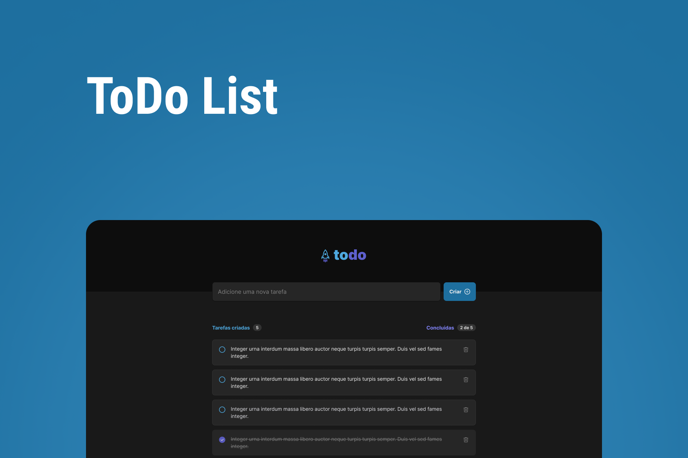

<h1 align="center">
  
</h1>

<h1 align="center">
  
</h1>

# Sobre o projeto

<p>Crie tarefas e organize seu dia-a-dia com essa ferramenta totalmente gratuita.
</p>

# Tecnologias

- [Vite](https://vitejs.dev/)
- [ReactJs](https://reactjs.org/)
- [TypeScript](https://www.typescriptlang.org/)
- [Phosphor React](https://github.com/phosphor-icons/phosphor-react)
- [Css Modules](https://github.com/css-modules/css-modules)

## Como baixar o projeto

```bash
# Clonar o repositório
$ git clone https://github.com/wellingtonrodriguesbr/01-todo-list.git

# Entrar no diretório
$ cd 01-todo-list


# Instalar as dependências
$ npm install

# Rodar o projeto
$ npm run dev
```

<br/>
<hr/>

<p align="center">Desenvolvido por <a href="https://www.linkedin.com/in/wellingtonrodriguesbr/" target="_blank">Wellington Rodrigues</a> ✌🏽</p>
